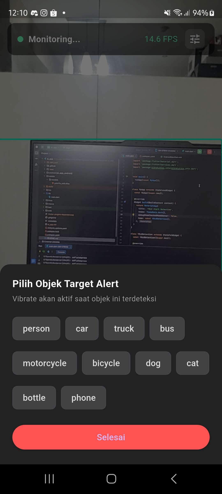
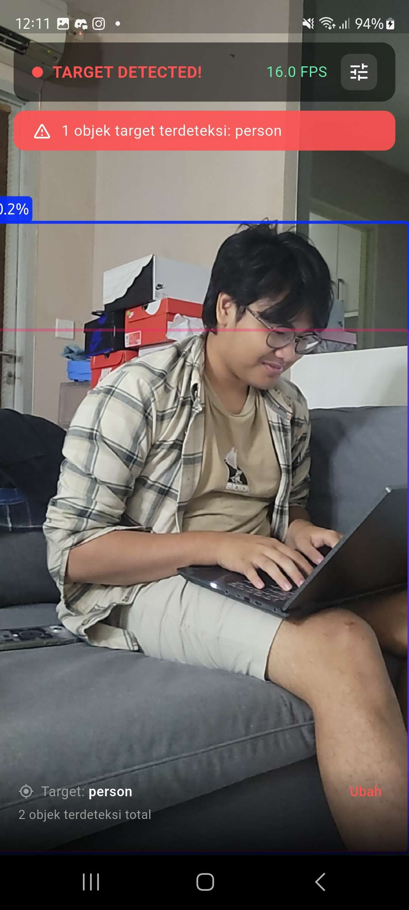
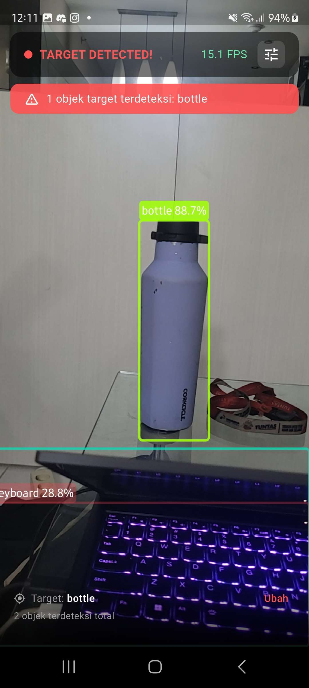

# YOLO Alert Detection

Aplikasi Flutter untuk realtime object detection dengan fitur **alert/notifikasi getar** saat objek target terdeteksi. Cocok dipakai sebagai simple security cam.

## Fitur

- Realtime detection via kamera belakang (YOLO11n)
- Haptic feedback (vibrate) saat objek target muncul di frame
- Visual flash overlay merah saat alert aktif
- Cooldown 3 detik agar tidak spam vibrate
- Pilih objek target secara dinamis (person, car, dog, dll.)
- FPS counter di top bar

## Dependencies

```yaml
dependencies:
  flutter:
    sdk: flutter
  ultralytics_yolo: ^0.3.1
```

> `HapticFeedback` sudah built-in dari `flutter/services.dart`, tidak perlu plugin tambahan.

## Setup Model

Letakkan file model di:

```
assets/models/yolo11n_int8.tflite   # Android
```

Daftarkan di `pubspec.yaml`:

```yaml
flutter:
  assets:
    - assets/models/
```

## Cara Pakai

1. Jalankan app → kamera langsung aktif
2. Tap ikon settings di pojok kanan atas untuk memilih objek target
3. Saat objek target masuk frame → device **getar** + layar **flash merah**
4. Alert punya cooldown 3 detik agar tidak terus-menerus getar

## Struktur Kode

```
main.dart
├── MyApp               # Root widget
└── YOLODetection       # Stateful widget utama
    ├── _processDetections()   # Logic alert + cooldown
    ├── _triggerAlert()        # Haptic + animasi flash
    ├── _showTargetPicker()    # Bottom sheet pilih target
    ├── _buildTopBar()         # Status bar + FPS
    ├── _buildAlertBanner()    # Banner merah saat detected
    └── _buildBottomPanel()    # Info target aktif
```

## Objek yang Tersedia

`person` · `car` · `truck` · `bus` · `motorcycle` · `bicycle` · `dog` · `cat` · `bottle` · `phone`

> Objek lain bisa ditambahkan manual di list `_availableLabels` sesuai label model yang dipakai.

## Screenshot Aplikasi


